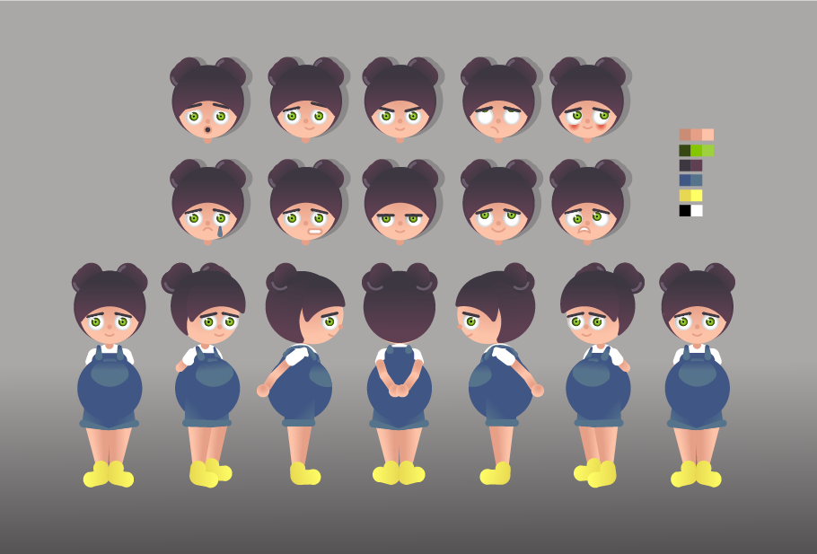
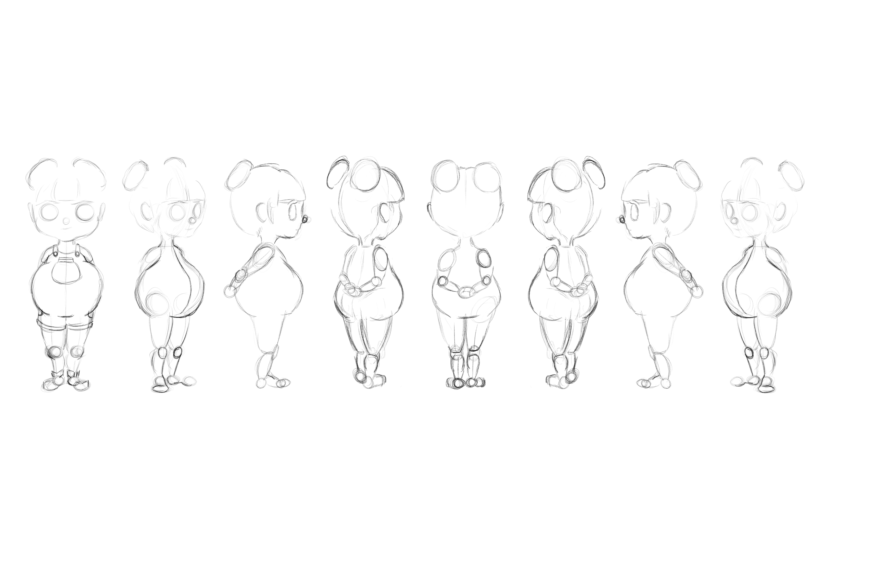
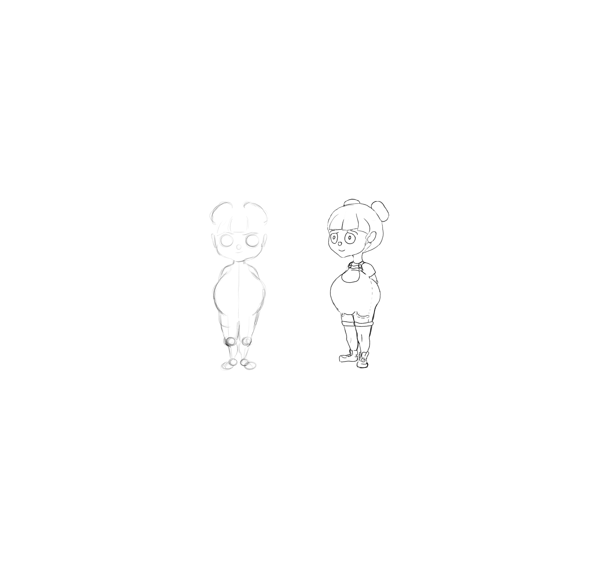

# 🎬 Character Concept – Illustrator 2D Design & Animation  
<br>

<p>
  
  
  
  
</p>

<p align="center">
  
  <br>
  <em>🎨 Illustrator Concept Overview</em>
</p>

This project showcases the complete **character design and 2D animation process** made in **Adobe Illustrator**, from early sketch explorations to full color development and motion tests.  
The goal was to design a **stylized, expressive character** with a strong personality and simple geometric shapes suitable for animation.

> *A journey from sketch to motion — blending illustration, color theory, and movement. 🌈*

## 🖼️ Preview Gallery  

### ✏️ Concept Sketches  
<div align="center">
 <td align="center"><strong>📏 Model Sheet – Structure & Rotation</strong><br></td>
<table>
  <tr>
    <td align="center"><strong>📐 Model Sheet – Action Line Studies</strong><br></td>
    <td align="center"><strong>🧩 Character Construction</strong><br></td>
  </tr>
</table>
 <td align="center"><strong>🎨 Illustrator Concept Overview</strong><br></td>
</div>
<br>

### 🎨 Color Exploration  
<div align="center">


</div>

<br>

### 🎞️ Animation Previews  
<div align="center">

<table>
  <tr>
    <td align="center"><strong>✨ Character Sketch Animation (GIF)</strong><br></td>
  </tr>
</table>

</div>

<br>

## 🗂️ Project Structure  

```bash
Character-Concept-Illustrator/
├── preview/                        # Final design previews
│   ├── COLOR PERSONAJE.png
│   └── Illustrator_character_concept.png
│
├── preview-scketches/              # Early sketches and model sheets
│   ├── Model Sheet_linea de accion (1).jpg
│   ├── Model Sheet_linea de accion (2).jpg
│   └── personaje.png
│
├── preview-animation/              # Animation tests
│   ├── Character-scketchGIFanimado.gif
│   └── animacion personaje .png
│
├── preview-animations/             # Motion studies and pose-to-pose videos
│   ├── POSETOPOSE.mp4
│   └── bear-falling.mp4
│
└── README.md                       # Project documentation (this file)
```

## 🧠 Concept & Process

This project began with simple geometric sketches inspired by children’s illustration.
The design evolved into a round, minimalist character with exaggerated proportions — easy to animate and visually charming.
Color palettes were tested using **complementary and triadic schemes** to enhance expressiveness.

Key stages:

- ✏️ Sketching & silhouette exploration

- 🎨 Color theory application and Illustrator vector modeling

- 🧩 Model sheet creation for consistency

- 🎞️ Animation test using pose-to-pose techniques

> *The goal was to create a 2D character that feels alive through emotion, rhythm, and color harmony. 💛*

## 👩‍💻 Author

**Génesis Vaca Palma**

*2D & 3D Artist · Web Developer · Data Analyst in progress*

<br>
